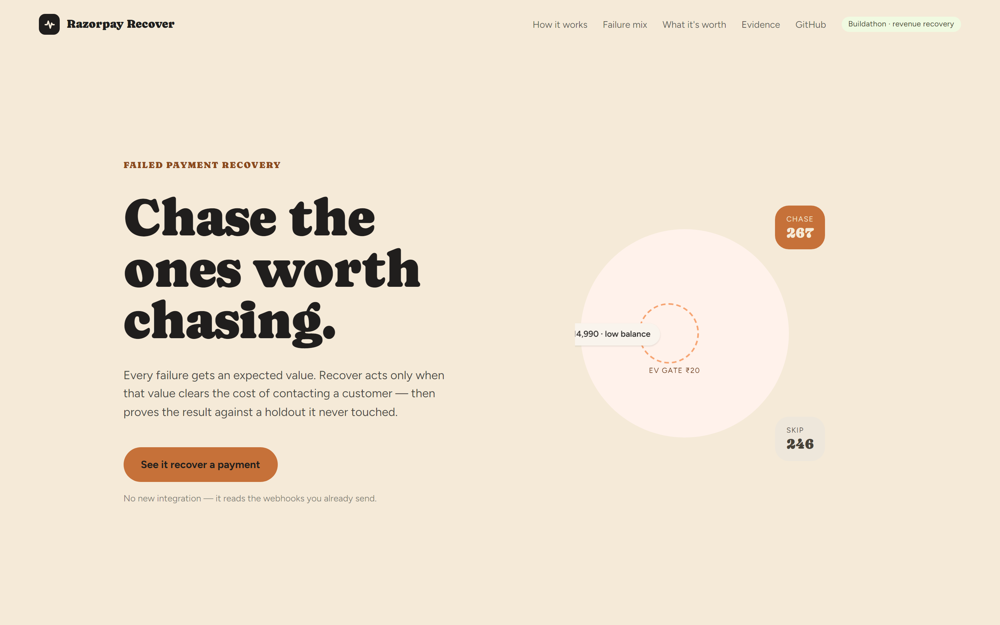
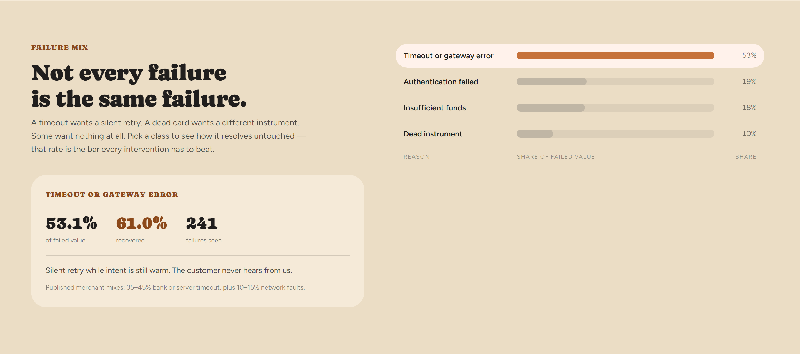
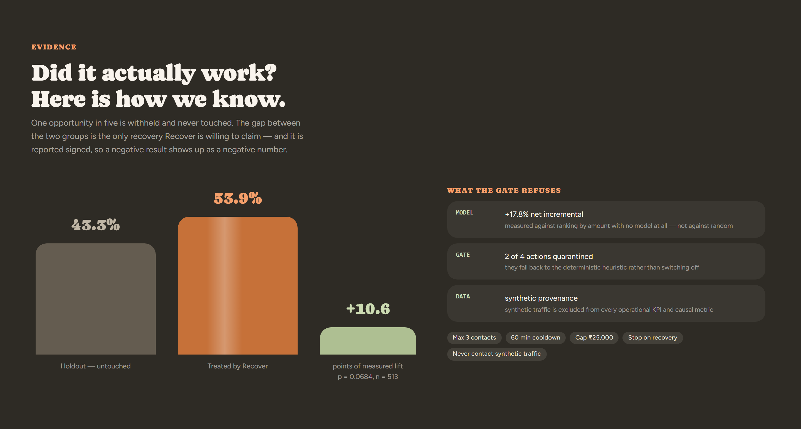
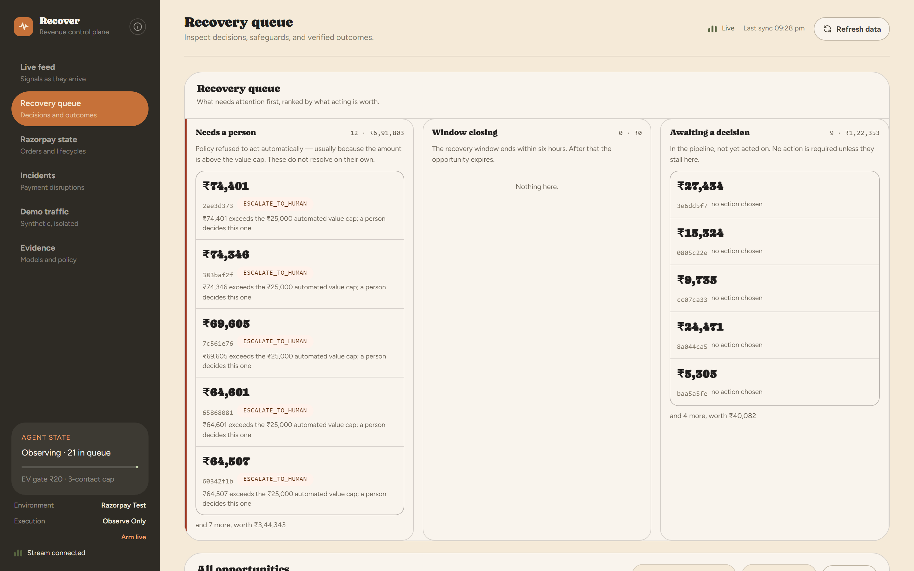
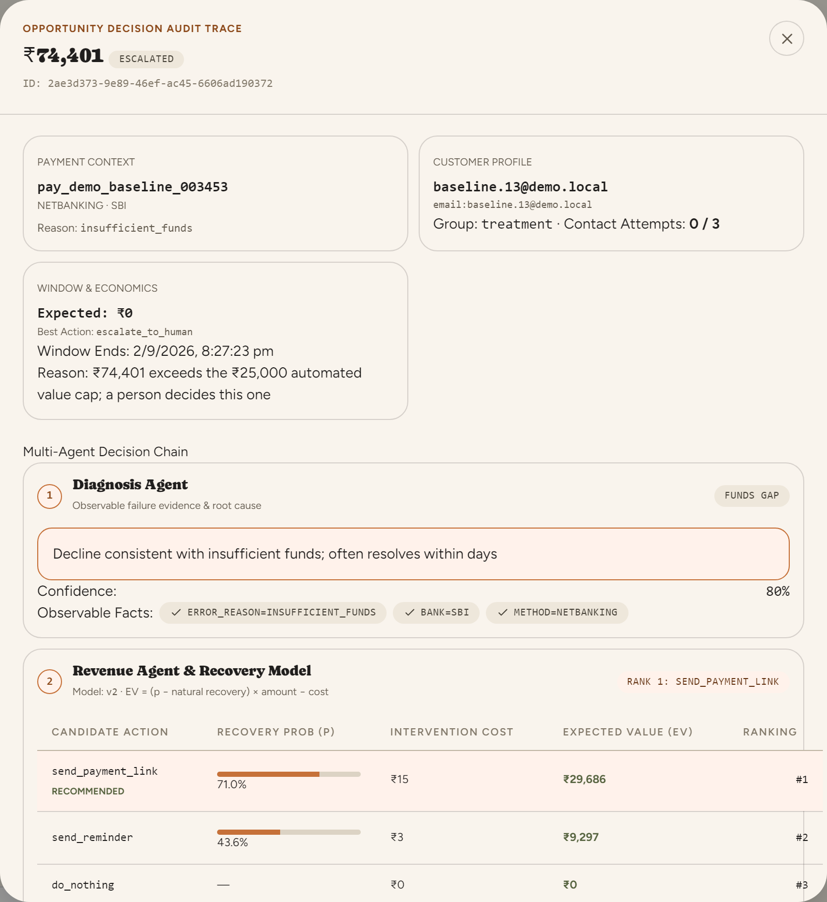
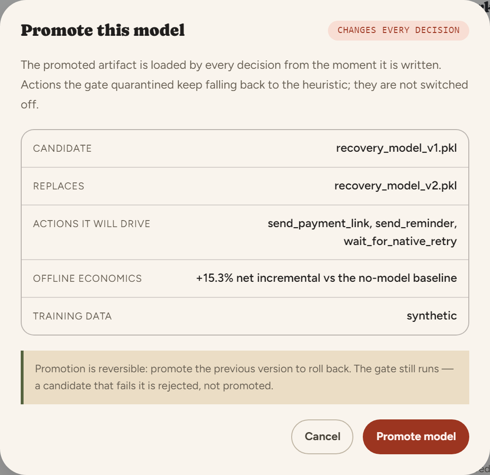
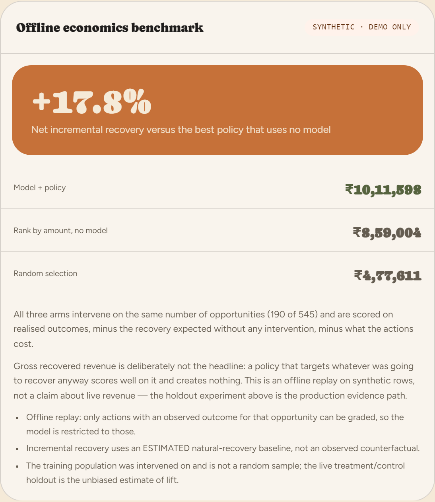

# Revenue Recovery Control Plane

**Live: [pikachu-5.github.io/razorpay](https://pikachu-5.github.io/razorpay/)**

An observe-first Razorpay revenue-operations prototype that detects payment failures, identifies recoverable revenue, selects policy-gated interventions, and records every decision and outcome with explicit data provenance. Backend runs on Azure App Service + Postgres; frontend deploys to GitHub Pages, both via GitHub Actions on every push to `main`.



## What it looks like

The landing page states the thesis, then the body pages through how it works,
the failure mix, what it is worth, and the evidence. **See it recover a payment**
opens the operator console — which opens with a short guided tour on your first
visit, pinning a small card next to whichever KPI, panel, or control it's
explaining rather than covering the screen. Reopen it anytime from the **?**
icon next to the logo.

| | |
| --- | --- |
|  **Failure mix** — every class, its share of failed value, and how often it comes back untouched. Read live from this install. |  **Evidence** — the withheld holdout against the treated group, with the p-value and sample size attached. |



The console opens on the live feed and the recovery queue: what needs a person,
what is closing, and what is merely waiting.



Every decision keeps its full chain: the diagnosis and its evidence, each
candidate action with its probability, cost and expected value, the policy rules
that passed or failed, and what actually executed. The trace above is one the
policy engine refused: the model ranked a payment link first at ₹29,686 expected
value, and the ₹25,000 automated cap sent it to a person instead.



Consequential actions state their blast radius before they run, not after.
Promotion names the artifact it replaces, the actions it will drive, the
economics on its card, and the provenance of its training data — and says
plainly that it changes every decision from the moment it is written.



The economics benchmark is the one worth reading closely. All three arms
intervene on the same number of opportunities and are scored on realised
outcomes, minus the recovery expected without any intervention, minus what the
actions cost. The figures it currently reports are in
[What it measures right now](#what-it-measures-right-now).

## Where the numbers come from

Two kinds of figure appear, and they are never mixed:

- **Claims about this system** — recovery rates, lift, the failure mix, the EV
  gate, contact caps — are read live from the running install. Nothing *in the
  product* is a hardcoded figure; the numbers quoted in this README are a
  snapshot of one seeded install, and the section below says which.
- **Claims about the market** — the failure-rate slider's default, the
  published merchant failure mix — come from cited public sources, linked in
  the page footer. Indian merchants run 92–96% blended payment success, so 4–8%
  of attempts fail; the calculator defaults to the 6% midpoint.

## What it measures right now

Every figure below is read from an install seeded with the 30-day baseline
(`--days 30`). That traffic is **synthetic**, so these demonstrate that the
measurement works — they are not evidence of real-world lift. Reproduce them by
seeding and reading the Evidence tab.

**The failure mix** — 513 failures worth ₹61.7L. The recovery column is the rate
each class comes back *without any intervention*, which is what every expected
value is scored against:

| Failure class | Share of failed value | Recovers untouched | n |
| --- | --- | --- | --- |
| Timeout or gateway error | 53.1% | 61.0% | 241 |
| Authentication failed | 18.8% | 47.9% | 121 |
| Insufficient funds | 18.3% | 45.8% | 96 |
| Dead instrument | 9.8% | 32.7% | 55 |

**The holdout** — 20% of opportunities are never touched:

| | Treated | Untouched holdout |
| --- | --- | --- |
| Opportunities | 423 | 90 |
| Recovered | 228 (53.9%) | 39 (43.3%) |

That is +10.6 points, an estimated ₹5,30,185 incremental — at **z = 1.822,
p = 0.0684**. The console prints that verdict as `Not significant · p=0.0684`
rather than rounding it up to a lift claim, and with demo traffic switched off
it reports `Insufficient sample` instead, because the control arm holds 90 cases
against a 100-case floor. A number this system has not earned is a number it
will not claim.

**The promotion gate**, on the held-out test split:

| Action | n | ROC-AUC | Status |
| --- | --- | --- | --- |
| `send_payment_link` | 545 | 0.6946 | enabled |
| `send_reminder` | 299 | 0.6441 | enabled |
| `wait_for_native_retry` | 146 | 0.5496 | **quarantined** — AUC below 0.55 |
| `prompt_card_change` | 50 | 0.5390 | **quarantined** — AUC below 0.55, and n below 100 |

Quarantined actions fall back to the deterministic heuristic rather than being
switched off, so expected-value ranking keeps its full action space.

**The economics benchmark**, with all three arms intervening on the same 190 of
545 opportunities and scored net of both the do-nothing counterfactual and the
cost of acting:

| Arm | Net incremental |
| --- | --- |
| Model + policy | **₹10,11,598** |
| Rank by amount, no model | ₹8,59,004 |
| Random selection | ₹4,77,611 |

The gap that counts is the first against the second — **+17.8%** — because
ranking by amount is the strongest thing you can do without a model at all.
Against random it would be +112%, which is why that comparison is not the one
the gate tests.

## What is implemented

- Signed Razorpay webhook ingestion with fail-closed HMAC verification and deduplication.
- Failure-to-opportunity pipeline, customer/payment history, intervention verification, and full audit trail.
- Diagnosis, per-action recovery predictions, expected-value ranking, and a deterministic safety policy the model cannot overrule.
- Expected value is measured against the do-nothing counterfactual: actions are ranked on the recovery they *add* over the rate at which these failures resolve on their own, net of what the action costs.
- Order-centric recovery deduplication plus Razorpay Order, Payment Link, downtime, subscription, invoice, refund, and dispute lifecycles.
- Webhook-first state with bounded Razorpay API reconciliation for duplicate, delayed, missed, or out-of-order delivery.
- Observe-only by default (`SHADOW_MODE=true`): customer-facing actions are recorded without sending links or notifications until explicitly armed live — from the landing page's CTA, or from the **Execution** row in the console sidebar itself, both behind a preflight confirm.
- Segment-level (method × bank) incident detection, simulation, response budgets, and dashboard visibility.
- Deterministic 80/20 treatment/control holdout for counterfactual recovery measurement.
- Synthetic data isolation from operational KPIs and experiments, plus a verified decision-time feature export for later real-data training.
- Per-action ML quarantine with heuristic fallback, model cards, gated promotion, and a responsive evidence-first React operations console.
- An operator preflight on every consequential action: batch incident response, model promotion, and manual re-decide each show scope, execution mode, and what cannot be undone before they run.

## Deployment

The live install runs the backend (FastAPI + Postgres) on Azure App Service
and Azure Database for PostgreSQL, and the frontend on GitHub Pages. Both
deploy from [`.github/workflows/ci.yml`](.github/workflows/ci.yml) on every
push to `main`, gated behind the backend and frontend test jobs passing
first. Azure authentication uses OIDC federated credentials, not a stored
secret. A second workflow, [`postgres-schedule.yml`](.github/workflows/postgres-schedule.yml),
stops and starts the database on a cost-saving nightly schedule outside
any period the install needs to stay reachable around the clock — mirrored
client-side in [`maintenanceWindow.ts`](frontend/src/utils/maintenanceWindow.ts)
so the frontend shows an honest "resting" message instead of failed requests
while it's down.

## Start locally

```powershell
docker compose up -d postgres
.\.venv\Scripts\python -m alembic upgrade head
powershell -File scripts\dev_server.ps1

cd frontend
npm run dev
```

Open http://localhost:5173. The backend API documentation is at http://localhost:8000/docs.

Set Razorpay **Test Mode** credentials and a webhook secret in `.env` before using live test-mode payment links. See [the webhook runbook](docs/runbook-webhooks.md).

The checked-in `.env.example` keeps `SHADOW_MODE=true`. Only set it to `false`
after credentials, webhook delivery, reconciliation, and policy limits have been
verified in the intended test account. `RAZORPAY_MODE=live` identifies live data;
it does not bypass shadow mode or policy controls.

The Postgres container is exposed on host port **55432** so it does not collide
with a workstation's existing PostgreSQL service.

## Control-plane authentication

Every state-changing operator request carries `CONTROL_PLANE_API_KEY` in an
`X-Control-Plane-Key` header: simulation start/stop, anomaly scan, incident
response, manual re-decide, shadow-mode changes, reconciliation, and model
promotion. A separate `CONTROL_PLANE_ADMIN_API_KEY` restricts `force: true`
model promotion to an administrator. Razorpay webhooks are authenticated by
their signature instead, not this header.

Only `APP_ENV=dev`, `test` or `local` skips that entirely, which is why
`APP_ENV` **defaults to `production`**: those values disable authentication, and
a deployment that never sets the variable must not inherit the convenient
default. The checked-in `.env.example` sets `dev` explicitly for local work.

The console never holds the operator key at build time. Vite inlines
build-time values into the public JavaScript bundle, so an earlier
`VITE_CONTROL_PLANE_KEY` would have published the key to every visitor of the
GitHub Pages install. The key is supplied per browser tab instead:

```js
sessionStorage.setItem('recover_control_plane_key', '<key>')
```

**The public demo install is an exception, and says so.** Setting
`CONTROL_PLANE_OPEN_DEMO=true` leaves operator actions unauthenticated on
purpose, so a reviewer can drive the console — arm live execution, run a
simulation, dispatch a batch — without credentials. It is a declared posture
rather than an unset variable: it is refused unless `RAZORPAY_MODE=test`, it
grants the operator role but never admin (so forced model promotion still needs
a key), the process warns about it at startup, and the console sidebar shows an
**Open demo · no key** badge. Any install that is not a throwaway demo leaves it
`false`.

### What the public demo is allowed to do

Open access is bounded rather than unconditional. The bounds exist because a
shared install has to survive strangers, and they are stated here because a
limit nobody can see is indistinguishable from a bug:

- **Two actions stay behind a key even in an open demo.** Model promotion
  rewrites the promotion pointer, which governs every later decision for every
  visitor, not just the caller. Reconciliation spends the merchant's real
  Razorpay API quota. Both reach outside the demo's own data, so both return
  403. Everything else — simulation, anomaly scan, batch response, re-decide,
  arming execution — stays open.
- **A run is capped at ~300 synthetic payments** (150/min for 120s, against
  600/min for 900s locally). The console's own presets top out at 90 payments,
  so a visitor never meets the ceiling; only abuse does.
- **A global ceiling** refuses new runs past `DEMO_MAX_SYNTHETIC_PAYMENTS`.
  Per-run caps bound each run; only this bounds the total.
- **A global cooldown** paces runs, rather than a per-IP limit. Only one
  simulation can run at a time in the first place, so the contended resource is
  already global — and unlike a per-IP counter, a global one cannot be evaded by
  arriving from another address, nor spoofed through a forwarded-for header that
  Azure App Service appends to rather than replaces.

Every one of these applies only while the open-demo flag is set. A local install
runs unrationed.

## Concurrency, and the one limit on it

The pipeline itself is replica-safe: the autonomous monitor uses Postgres-backed
webhook claims, durable monitor events, and transaction-scoped advisory locks,
so multiple API replicas do not double-process webhooks or scheduled
detector/sweeper work.

The shadow-mode override is the exception, and is worth stating rather than
hiding. It lives in the process that served the request, which is correct only
because the deployed install runs a single uvicorn worker
([`backend/startup.sh`](backend/startup.sh)). Running several workers or App
Service instances would let them disagree about whether execution is armed, so
scaling out has to come with a durable shared store for that one flag.
`/api/policy/operating-mode` reports `shadow_mode_scope` so no caller has to
infer it.

For a higher-volume production deployment, run the checked-in Alembic migrations
and size the database and event-retention policy for the merchant's traffic.

## Verify

```powershell
.\.venv\Scripts\python -m ruff check backend training scripts

cd backend
..\.venv\Scripts\python -m pytest -q

cd ..\frontend
npm run build
npm run lint
npm test
```

The backend suite needs PostgreSQL because it provisions `recovery_test` on
localhost:55432. It writes only to that database and to a temporary artifacts
directory, never to the checked-in `models/artifacts`.

## Demonstration

A fresh install has no history. Seed a deterministic baseline first, otherwise
the first thing a reviewer sees is an empty dashboard:

```powershell
# 24 hours of healthy traffic — makes the live feed and incidents meaningful
.\.venv\Scripts\python scripts\seed_demo_baseline.py

# ~2 minutes; enough volume for the holdout to report a measurement
.\.venv\Scripts\python scripts\seed_demo_baseline.py --days 30
```

`--days 30` produces about 513 failures, which the deterministic assignment
splits 423 treatment / 90 control — a shade under 20%, because the split is a
stable hash of the opportunity rather than a quota. That leaves the control arm
just below the 100-case floor, so the Evidence tab reads
`Not significant · p=0.0684` instead of claiming a lift. Raise `--days` if you
want it to clear the gate; the seeder prints the shortfall it computes.

Seeded history is flagged `is_synthetic`. The live feed opens *including* it
by default, exactly like the Evidence tab and the landing page's failure mix
already do, so a seeded install never opens on a wall of zeros — flip **Show
real payments only** any time to see just genuine Razorpay activity instead.
Anything built from synthetic data is labelled a demonstration of the
measurement machinery, never evidence of real lift.

Then use [RUNBOOK.md](RUNBOOK.md) for the complete judge/demo flow. It includes a
safe preflight, four failure scenarios, expected observable results, and Test
Mode cautions.

## Important boundaries

- This is a prototype, not a production deployment. Production-tier model promotion requires verified live-data provenance.
- The promoted model is trained on **synthetic** data and is labelled `demo_only`. It clears the offline gate (+17.8% net incremental against the strongest no-model policy), but offline replay is not evidence of live lift — the treatment/control holdout is. See [docs/TRAINING.md](docs/TRAINING.md).
- The gate is real and it bites: `prompt_card_change` and `wait_for_native_retry` failed it and are quarantined. Quarantined actions fall back to the heuristic rather than being switched off, so the action space stays intact.
- A trained artifact only reaches live traffic through `models/artifacts/PROMOTED.json`. Placing a `.pkl` in the registry does nothing on its own.
- With shadow mode disabled, automated payment-link actions can create objects in the configured Razorpay account. Keep shadow mode enabled when demonstrating detection only.
- Synthetic demo traffic is labelled and excluded from operational KPIs, causal experiments, and verified training exports.
- Experiment metrics are signed: a negative incremental-revenue value is an important result, not an error.
